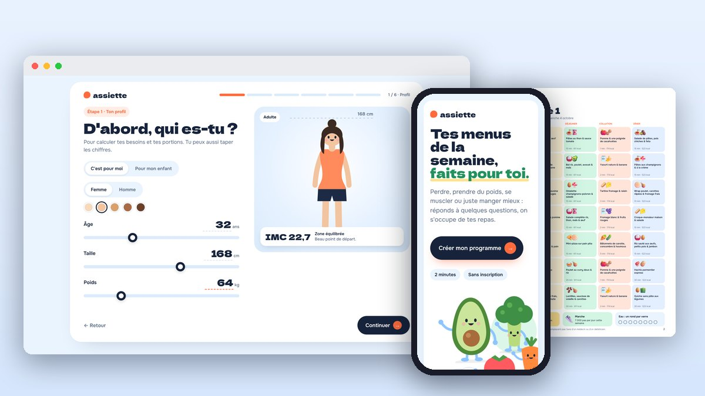
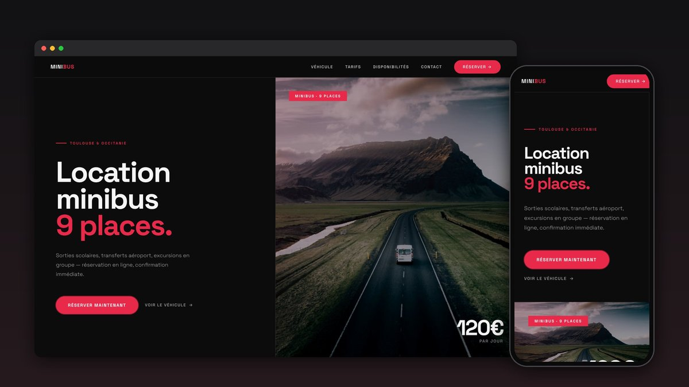
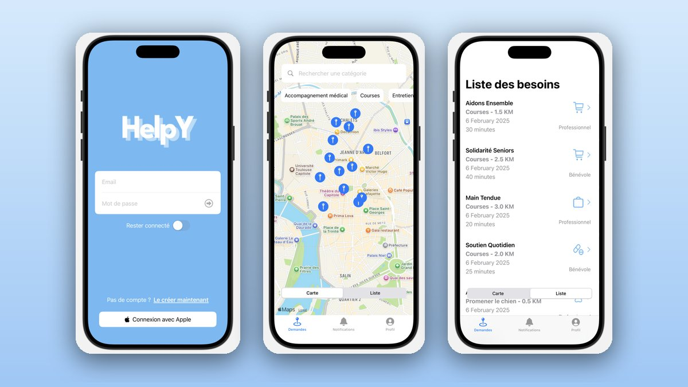
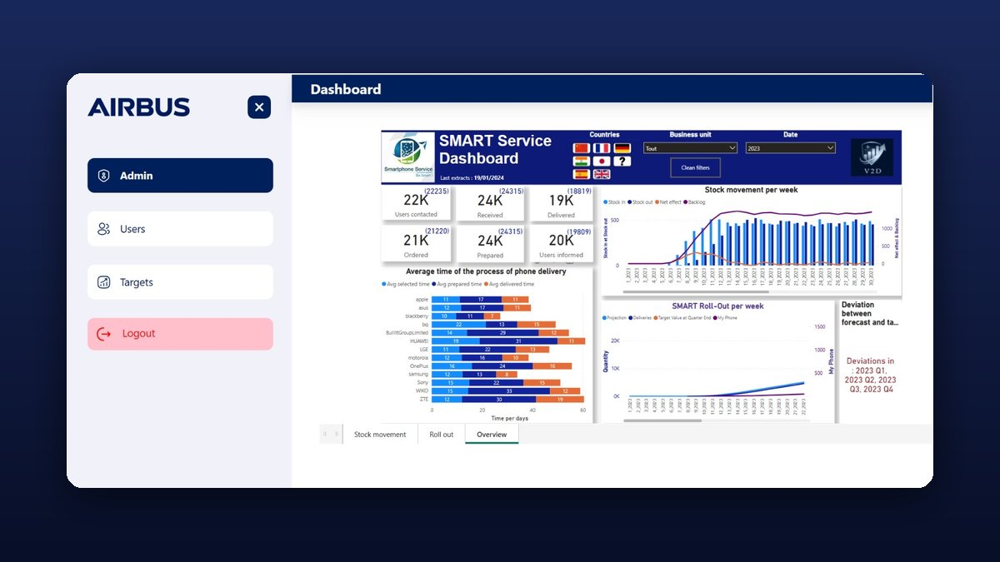
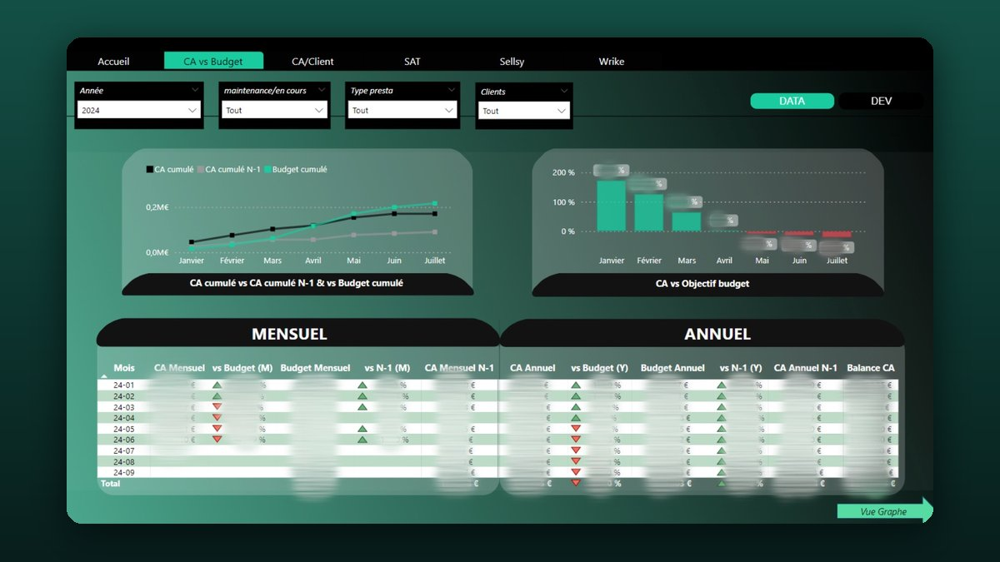

<h1 align="center">Hi 👋, I'm Hakima</h1>

    

---

## 🌟 About Me  

🔹 **Data Analyst** & **Self-taught Full Stack Developer** based in France 🇫🇷  
🔹 Always learning and improving my skills 🚀  

---

<!-- snake graph -->

  <picture>
    <source media="(prefers-color-scheme: dark)" srcset="https://github.com/haaaaakima/haaaaakima/blob/main/snake-dark.svg" />
    <source media="(prefers-color-scheme: light), (prefers-color-scheme: no-preference)" srcset="https://github.com/haaaaakima/haaaaakima/blob/main/snake.svg" />
    
  </picture>

---

## 🚀 Featured Projects

<table>
<tr>
<td width="50%" valign="top">

<h3><a href="https://github.com/haaaaakima/assiette">🥑 assiette</a></h3>

Live product: personalised meal plans in 2 minutes. Guided questionnaire, nutrition engine, generated PDF programme and calendar, Stripe payments.

JavaScript · Netlify Functions · Stripe · PDF generation · <a href="https://assiette-app.netlify.app">Live site ↗</a>

</td>
<td width="50%" valign="top">

<h3><a href="https://github.com/haaaaakima/minibus">🚐 MiniBus Location</a></h3>

Minibus rental website: availability calendar, 3-step online booking, deposit payment, automatic e-mails and admin dashboard.

PHP · MySQL · JavaScript

</td>
</tr>
<tr>
<td width="50%" valign="top">

<h3><a href="https://github.com/haaaaakima/AppSanteSwift">🤝 HelpY</a></h3>

iOS app connecting volunteers and professionals with people who need help nearby, with an interactive map. Designed in Figma first.

Swift · SwiftUI · MapKit · Figma

</td>
<td width="50%" valign="top">

<h3><a href="https://github.com/haaaaakima/list-meteo-in-swift">🌦️ Weather App</a></h3>

Technical test: live weather for French cities with animated backgrounds, search and °C / °F switch.

Swift · SwiftUI · REST API · async/await · MVVM

</td>
</tr>
<tr>
<td width="50%" valign="top">

<h3><a href="https://github.com/haaaaakima/projet-airbus">✈️ Airbus Dashboard</a></h3>

Decision-support project: data architecture and Power BI dashboards to track stock, deliveries and roll-out.

Power BI · SQL · Data modeling

</td>
<td width="50%" valign="top">

<h3><a href="https://github.com/haaaaakima/rapport-de-stage">📈 Internship BI Dashboards</a></h3>

Power BI reporting built during my internship: revenue vs budget, revenue per client and the underlying data model.

Power BI · DAX · Data warehouse

</td>
</tr>
</table>

More: <a href="https://github.com/haaaaakima/List-movies-in-swift-swiftui">Movies catalogue (SwiftUI)</a> · <a href="https://haaaaakima.github.io/">Web games</a>

---

## 🌍 Connect with Me  

    

---

## ⚙️ Tech Stack  

    
    
    
    
    
    
    
    
    
    
    
    
    
    
    
    

